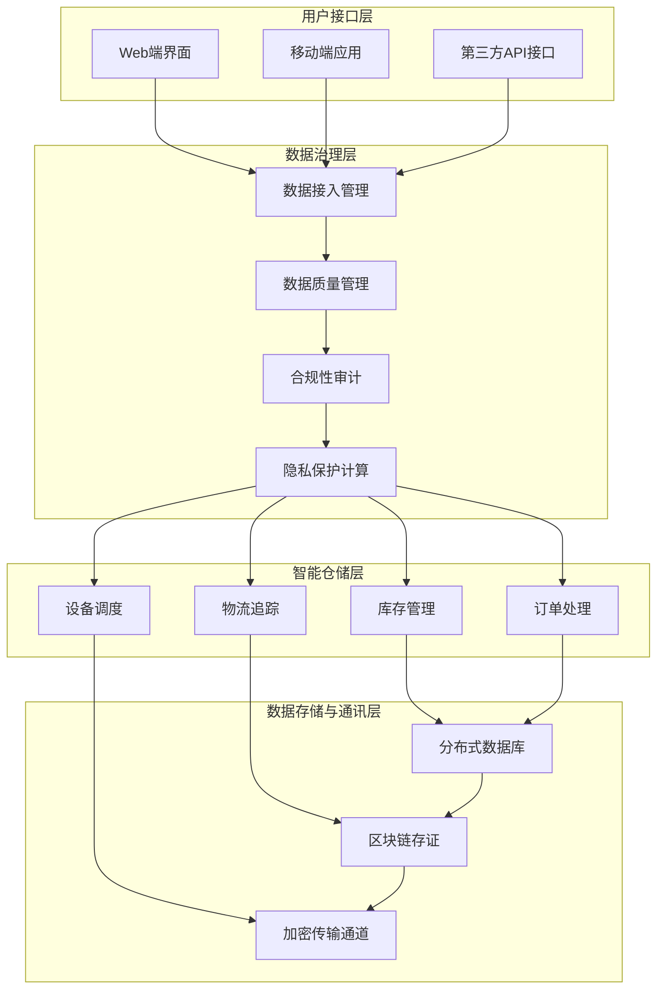

# **数信云仓：打造工业仓储新生态**

## 摘要

在全球化与数字化转型加速的背景下，制造业和供应链企业面临数据跨境流动合规难、仓储数据孤岛严重、安全风险高、协同效率低等核心挑战。传统智能仓储系统多聚焦于设备自动化，忽视了数据治理与跨主体可信协作。

“数信云仓”（ShuXin YunCang）是一个基于**可信数据空间**（Trusted Data Space）的工业级数据治理平台，深度融合**全同态加密、联邦学习、区块链存证、零信任架构**等前沿技术，构建面向智能仓储全流程的数据安全防护体系。我们致力于解决企业在跨境数据流通中的合规性、安全性与隐私保护难题，推动供应链上下游实现“数据可用不可见、价值共享可计量”的新型协作模式。

本白皮书阐述了项目的愿景、核心技术、系统架构、功能设计及发展路线图，旨在为开发者、企业用户与合作伙伴提供清晰的技术蓝图与合作方向。

------

## 1. 项目背景

### 1.1 政策驱动

近年来，国家密集出台数据要素相关政策，为数据流通奠定制度基础：

- 《数字中国建设整体布局规划》提出“2522”框架，强调数据作为新型生产要素的重要性。
- 《“数据要素×”三年行动计划（2024—2026年）》明确推动数据在制造、物流等场景的深度应用。
- 《可信数据空间发展行动计划（2024—2028年）》正式提出构建跨境可信数据空间，支持高效便利安全的数据跨境流动。

### 1.2 行业痛点

我们在对多家制造、物流企业的调研中发现三大核心问题：

1. **合规成本高**：跨境数据传输需满足多国法规（如GDPR、CCPA），企业缺乏自动化合规工具。
2. **数据安全薄弱**：仓储敏感数据（库存、客户信息）易泄露，传统权限管理难以应对复杂访问场景。
3. **协同效率低**：供应链上下游数据割裂，无法实现联合建模与实时协同，形成“数据孤岛”。

### 1.3 解决方案愿景

“数信云仓”旨在构建一个**去中心化、可审计、高安全**的工业数据协作网络，让企业在不暴露原始数据的前提下，实现：

- 跨境数据合规自动化审核
- 多方联合库存预测与路径优化
- 全流程数据操作上链存证
- 动态细粒度访问控制

------

## 2. 核心技术

### 2.1 可信数据空间（Trusted Data Space）

我们构建的可信数据空间是专为工业仓储场景定制的分布式基础设施，支持多方主体在共识规则下安全共享数据。其核心组件包括：

- **数据空间管理平台**：统一接入跨境电商、物流企业、监管机构等角色。
- **隐私计算引擎**：集成全同态加密、联邦学习、差分隐私，保障“数据不出域”。
- **动态信任评估机制**：实时评估参与方行为，动态调整访问权限。
- **智能合约与数据确权**：通过区块链记录数据流转全过程，明确权属。

### 2.2 全同态加密（Fully Homomorphic Encryption, FHE）

允许第三方直接对密文进行任意计算（加法、乘法），结果解密后与明文计算一致。
**应用场景**：第三方服务商远程分析仓库运行数据时，全程无需解密，彻底杜绝数据泄露风险。

### 2.3 联邦学习（Federated Learning）

在不共享原始数据的前提下，多个参与方协同训练机器学习模型。
**应用场景**：仓库与供应商联合训练库存预测模型，订单数据始终保留在本地。

### 2.4 区块链存证

利用区块链不可篡改、可追溯的特性，将以下关键操作上链：

- 数据访问日志
- 合规审计结果
- 权限变更记录
- 智能合约执行

确保所有操作“可查、可溯、可审计”。

### 2.5 零信任架构（Zero Trust）

遵循“永不信任，始终验证”原则，每次数据访问均需：

1. 身份认证（多因素）
2. 设备安全状态检查
3. 网络环境评估
4. 动态权限授予

------

## 3. 系统架构

------

## 4. 核心功能模块

| 模块         | 功能说明                                                     |
| ------------ | ------------------------------------------------------------ |
| **合规护航** | 自动解析全球数据法规，生成合规策略，支持一键生成合规报告     |
| **安全卫士** | TLS 1.3 + 国密SM4传输加密，全同态加密存储，零信任动态访问控制 |
| **智能洞察** | 基于LSTM+联邦学习的库存预测，安全多方计算优化运输路径        |
| **可视中枢** | 3D热力图展示全球仓库状态，支持自定义仪表盘与多维钻取分析     |
| **协同共赢** | 区块链存证数据共享行为，智能合约自动管理任务与权限           |
| **风险管控** | 实时监测异常行为（UEBA），模拟合规风险并生成热力图           |

------

## 5. 应用场景

### 场景1：跨境电商库存协同

- **问题**：海外仓与国内供应商需共享库存，但担心数据泄露。
- **解决方案**：使用联邦学习联合训练补货模型，原始数据不出域。

### 场景2：第三方远程运维

- **问题**：IT外包商需分析系统日志，存在数据泄露风险。
- **解决方案**：日志数据全同态加密，外包商直接在密文上分析。

### 场景3：海关合规申报

- **问题**：需向多国海关提交货物信息，流程繁琐。
- **解决方案**：自动生成符合各国要求的合规证明，并上链存证。

------

## 6. 发展路线图

| 阶段     | 时间      | 目标                                               |
| -------- | --------- | -------------------------------------------------- |
| **短期** | 2025–2026 | 完成核心平台开发，在自贸区开展示范应用             |
| **中期** | 2026–2027 | 技术优化，拓展至“一带一路”国家，建立国际合作伙伴   |
| **长期** | 2027+     | 打造全球可信数据网络，覆盖制造、医疗、金融等多行业 |

------

## 7. 开源与贡献

本项目采用 **Apache 2.0** 开源许可证，欢迎以下形式的贡献：

- 💡 提交 Issue（Bug 报告、功能建议）
- 🛠️ 提交 Pull Request（代码改进、文档翻译）
- 📚 编写教程或案例
- 🌍 推广社区生态

------

## 8. 联系方式

- **GitHub Discussions**: [讨论区链接](https://github.com/your-org/shuxinyuncang/discussions)

------

> © 2025 数信云仓项目组 保留所有权利。
> 本白皮书内容随项目演进持续更新。
